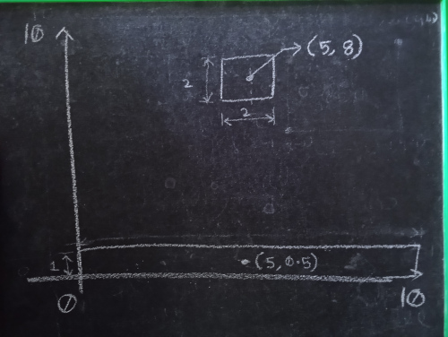

# Hello world
The objective is to draw a ground box and small box above above ground and make small box to fall.

## Files
**helloOpengl.cpp** - it draws the picture

**helloBox2d.cpp** - it prints output of simulation to console

**glBox.cpp** - combines opengl and box2d